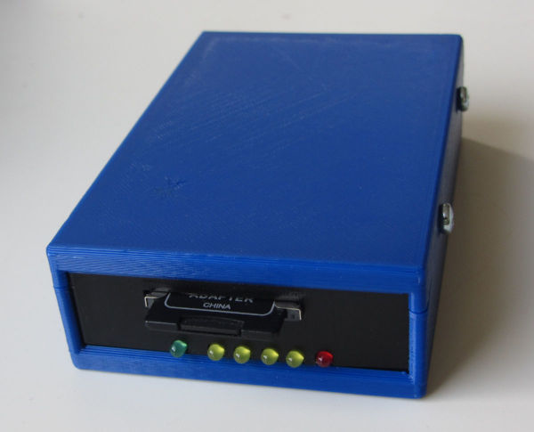

# PFBDK - Arduino Mega simulator of the Epson's Epsp based disk drives

This is my fork of William R. Cooke's PFBDK sketch found at 
http://wrcooke.net/projects/pfbdk/pfbdk.html

The intend is to add some features making it somewhat more convenient to 
use. The route will be very incremental to keep the basic functionality working.

The first feature is a command line on the debug/console port of the 
Arduino Mega and Pro Micro. The Mega is somewhat more expensive and larger,
but easier to program. For the Pro Micro a PCB is avaliable. For normal 
operation the two are equal. The usage is now:

	Usage (1.5.0):
 	C                - temp debug for driveNames[][]
 	D                - SD-card root directory
 	H                - this help
 	M[dnnnnnnnn.eee] - mount file nnnnnnnn.eee on drive d
 	Nnnnnnnnn.eee    - create an image file nnnnnnnn.eee
 	P[dw]            - write protect drive d; w=0 RW, w=1 RO
 	R                - temp reset Arduino

Note that most changes made are not persistent and will be lost when switching 
off or resetting the floppy emulator. The default settings are images D.IMG, 
E.IMG, F.IMG and G.IMG for the drives and all drives are writable.

The D commands lists only the root directory of the SD card.

The goal of the M-command is to change the images assigned to the 
simulated disk drives D: to G:. 

The N-command creates a new empty image file. It aborts when the image exists. 
This command and the data stored on the image are saved on the SD-card.

The P command emulates the floppy write tabs to write protect the disk.

Another added feature are the blinking lights.

Another plan was to respect the Read-Only attribute for the image files, 
emulating the floppy write protect, but this attribute is not supported in 
the SDLib library for VFAT disks.

The idea is make most settings controllable from the PX-4/PX-8 with 
custom commands and make settings persistent. So far only a demo for this is
realized; the write protect flag for each drive can be controlled from CP/M
with the pfbdkManagement/pfwp.asm program.

      Usage: PFWP <drive> <wp-state>
       drive = D, E, F, G. 
       wp-state: 0 = read-only, 1 = read/write

There are 3D-print files for both cases and more pictures on my own page 
at: https://electrickery.nl/comp/tf20/pxdisk/

fjkraan@electrickery.nl, 2023-05-20
