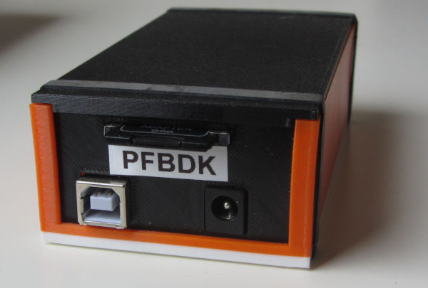

# PFBDK - Arduino Mega simulator of the Epson's Epsp based disk drives

This is my fork of William R. Cooke's PFBDK sketch found at http://wrcooke.net/projects/pfbdk/pfbdk.html

The intend is to add some features making it somewhat more convenient to use. The route will be very incremental to keep 
the basic functionality working.

The first feature is a command line on the debug/console port of the Arduino Mega. Its usage is now:

	Usage (1.5.0):
 	C                - temp debug for driveNames[][]
 	D                - SD-card root directory
 	H                - this help
 	M[dnnnnnnnn.eee] - mount file nnnnnnnn.eee on drive d
 	Nnnnnnnnn.eee    - create an image file nnnnnnnn.eee
 	P[dw]            - write protect drive d; w=0 RW, w=1 RO
 	R                - temp reset Arduino

The D commands lists only the root directory of the SD card.

The goal of the M-command is to change the images assigned to the simulated disk drives D: to G:. 
This could be made persistent via the Arduino EEPROM or a special file on the disk. 

The N-command creates a new empty image file. It aborts when the image exists.

The P command emulates the floppy write tabs.

Another plan was to respect the Read-Only attribute for the image files, emulating the floppy write protect, but this 
attribute is not supported in the SDLib library.

There is a 3D-printed case and pictures on my own page at: https://electrickery.nl/comp/tf20/pxdisk/

fjkraan@electrickery.nl, 2023-04-08
