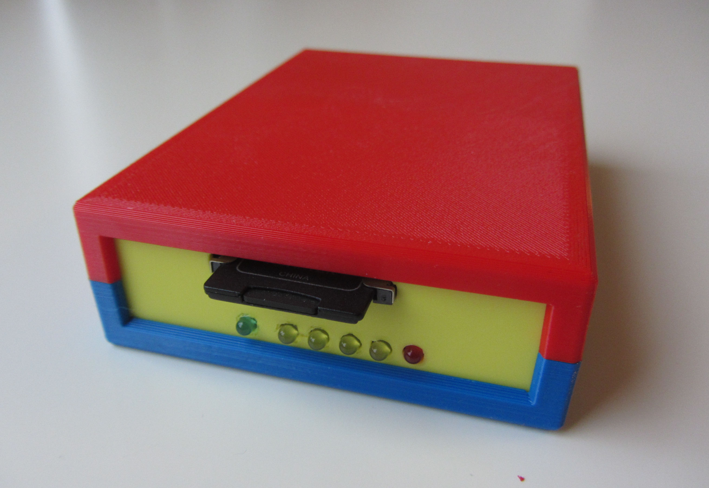

# PFBDK - Arduino Mega simulator of the Epson's Epsp based disk drives

This is my fork of William R. Cooke's PFBDK sketch found at 
http://wrcooke.net/projects/pfbdk/pfbdk.html

The intend is to add some features making it somewhat more convenient to 
use. The route will be very incremental to keep the basic functionality working.

For the Pro Micro a working PCB is created [PDF](PFBDK_promicro.kicad_sch.pdf), [KiCAD files](PFBDK_promicro_V1.0.complete.zip).

There are 3D-print files for the case and more pictures on my own page 
at: https://electrickery.nl/comp/tf20/pxdisk/

## Hardware extensions

Both Arduino solutions support blinking lights for the SERIAL line and each (emulated) drive. 

## PFBDK console commands

The first feature is a command line on the debug/console port of the 
Arduino Mega and Pro Micro. The Mega is somewhat more expensive and larger,
but easier to program. For normal operation the two are equal. The usage is now:

	Usage (1.5.0):
 	C                - temp debug for driveNames[][]
 	D                - SD-card root directory
 	H                - this help
 	M[dnnnnnnnn.eee] - mount file nnnnnnnn.eee on drive d
 	Nnnnnnnnn.eee    - create an image file nnnnnnnn.eee
 	P[dw]            - write protect drive d; w=0 RW, w=1 RO
 	R                - temp reset Arduino

Note that most changes made with these tools are not persistent (image 
creation being the exception) and will be lost when switching 
off or resetting the floppy emulator. The default settings are images **D.IMG**, 
**E.IMG**, **F.IMG** and **G.IMG** for the drives and all drives are writable.

### D

The D commands lists only the root directory of the SD card.

### M

The goal of the M-command is to change the images assigned to the 
simulated disk drives D: to G:. 

### N

The N-command creates a new empty image file. It aborts when the image exists. 
This command and the data stored on the image are saved on the SD-card.

### P

The P command emulates the floppy write tabs to write protect the disk.

Another plan was to respect the Read-Only attribute for the image files, 
emulating the floppy write protect, but this attribute is not supported in 
the SDLib library for VFAT disks.

## Control with native PX4 programs

The idea is make most settings controllable from the PX-4/PX-8 with 
custom commands and make settings persistent. After all the PX-4/8 talks to the PFBDK
using the [well documented EPSP protocol](https://electrickery.nl/comp/hx20/doc/SwAsDisAs.pdf), 
and extending the PFBDK firmware with new commands is entirely 
possible. 
For the PX-4 side some user programs can be added, similar in usage as the 
original COPYDISK program. So far only some demos for the
PX-4 are realized. The PX-8 uses another BIOS call, and will be implemented later.
For persistency, no solution is implemented yet, but the simplest
way would probably be to create a CP/M batch file on the RAM disk A: using the 
PF* commands to configure the PFBDK. 

### PFDIR4 - display SD-card root directory

        Usage: PFDIR4 [n]
         n = optional the start directory part 
          (each part is eight entries, ENTER and SPACE gets next part,
           other keys exit program)

### PFMNT4 - mount a SD-card image file to a drive

	  Usage: PFMNT4 [<drive> <name>]
       drive = D, E, F, G.
       name = SD card file image name.

### PFNEW4 - create a new empty image on the SD-card

	  Usage: PFNEW4 <name>'
       name = SD card file image name.

### PFWP4 - manage write protect flag of a drive

      Usage: PFWP4 [<drive> <wp-state>]
       drive = D, E, F, G. 
       wp-state: 0 = read-only, 1 = read/write
       

## Case

More photo's of the cases and the [3D-printer design files](https://electrickery.nl/comp/tf20/pxdisk/) 
at my main site.

## Extra tech

Creating applications consisting of two computers talking to each other is 
more complex than making just a program. I used this solution to inspect the
traffic between the PX-4 and the PFBDK: https://github.com/electrickery/DualSerialMonitor

fjkraan@electrickery.nl, 2024-12-16
